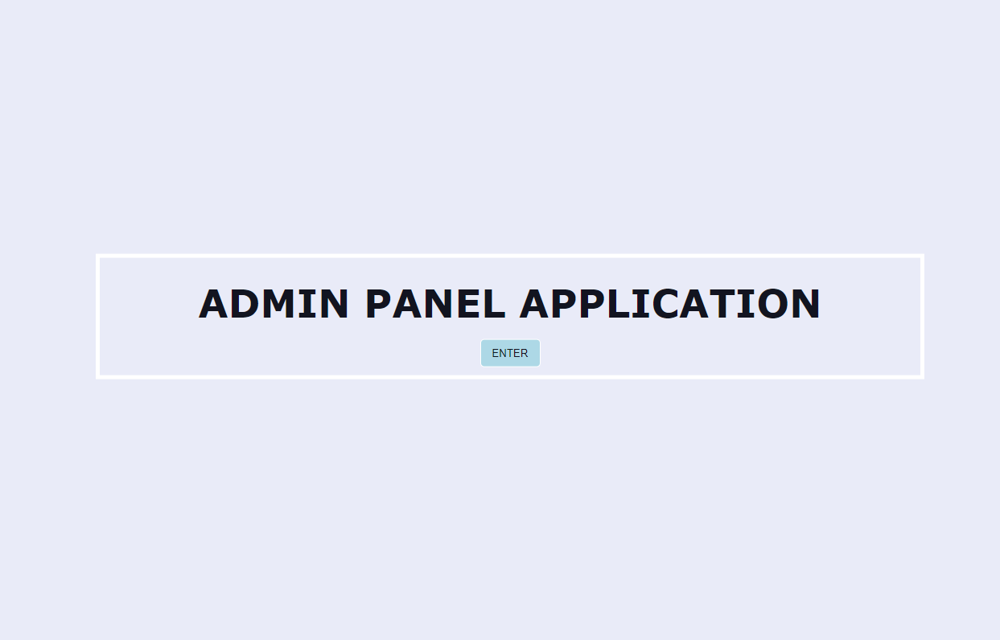
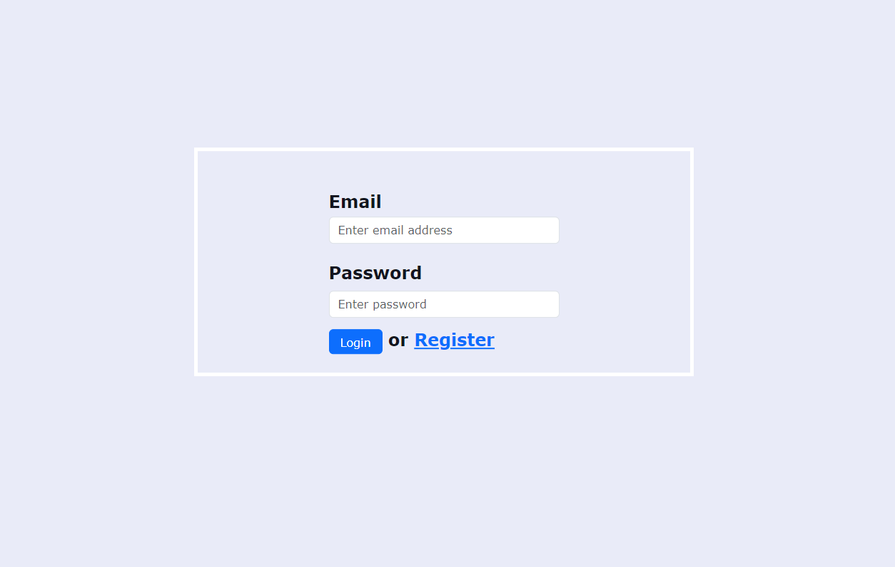
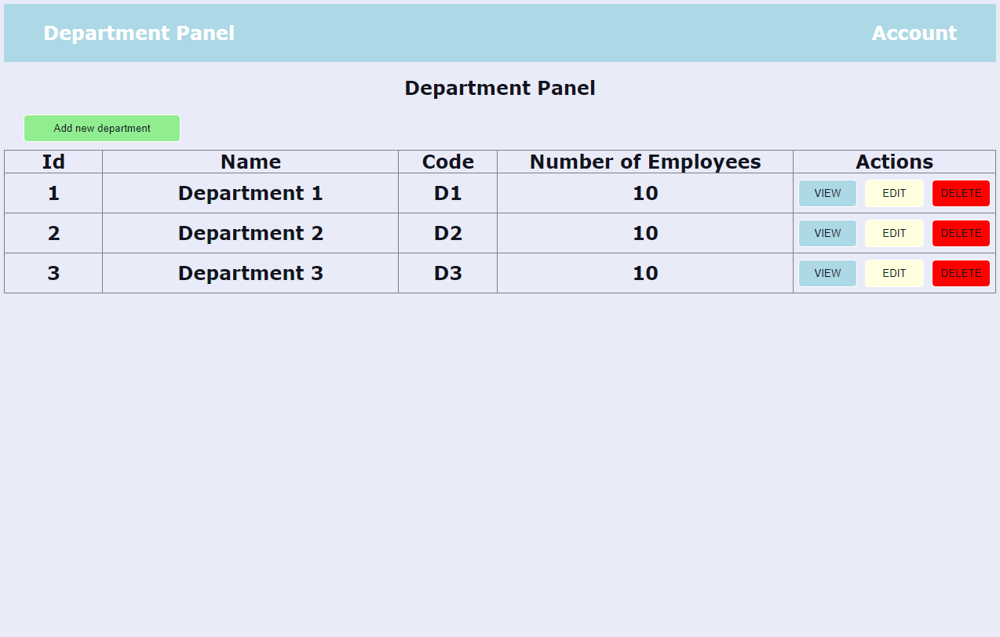
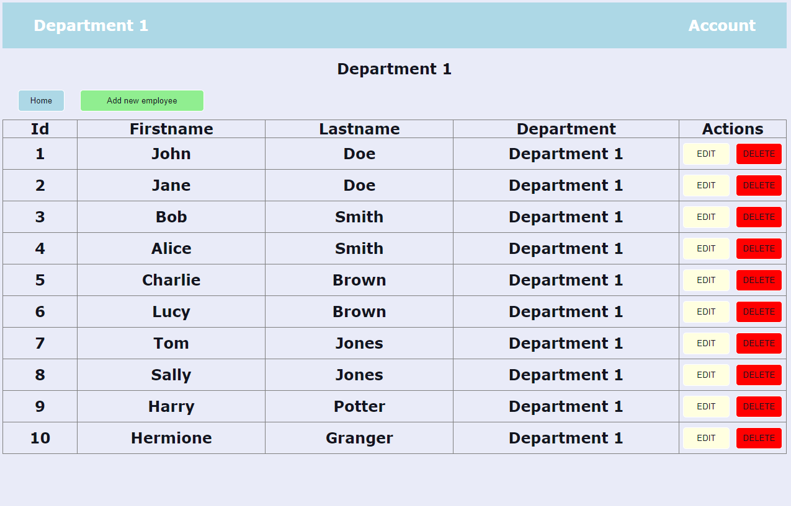
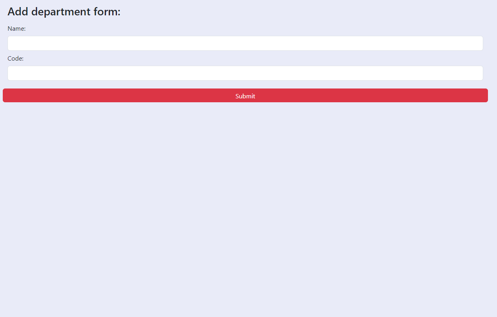

<!-- PROJECT LOGO -->

  

  <h3 align="center">Admin Panel Application</h3>
  
--------------------------------

<h2>Built With</h2> 

<ul>
  <li>SpringBoot</li>
  <li>SpringSecurity</li>
  <li>Thymeleaf</li>
  <li>HTML</li>
  <li>CSS</li>
  <li>Bootstrap</li>
  <li>MySQL</li>
  <li>Hibernate</li>
  <li>JPA</li>
  <li>Maven</li>
</ul>

<!-- GETTING STARTED -->
## Getting Started
- Home page (http://localhost:8080/home) is the only one page that can be viewed without user authentication.
- After clicking Enter button you will be redirected to login page (http://localhost:8080/login)
- There are 2 accounts, one for user and one for admin. The difference between user and admin is that user can only view the contents from admin panel, while the admin can do all CRUD operations.

  
(http://localhost:8080/home)

  
  
(http://localhost:8080/login)

  
  
(http://localhost:8080/departmentOverview)

  
  
(http://localhost:8080/employeeOverview)

  
  
(http://localhost:8080/department/add)

  
  
(<a href="#readme-top">back to top</a>)

